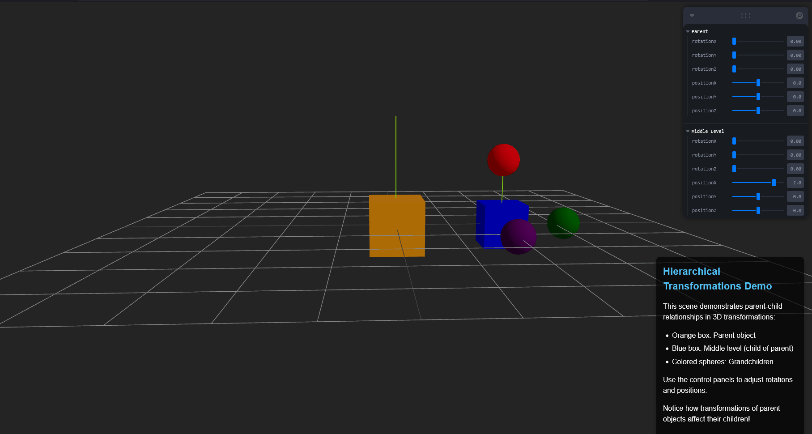

# Taller - Jerarquías y Transformaciones

# **Fecha**

`2025-05-03` -> Fecha de realización del taller

# Objetivo

Aplicar estructuras jerárquicas y árboles de transformación para organizar escenas y simular movimiento relativo entre objetos. Se busca comprender **cómo** las transformaciones afectan a los nodos hijos en una estructura padre-hijo y cómo visualizar estos efectos en tiempo real.

<br>

# Conceptos Aprendidos

- Jerarquías padre-hijo en escenas 3D
- Transformaciones relativas (rotación y posición)
- Propagación de transformaciones desde objetos padres hacia sus hijos
- Visualización y manipulación de objetos 3D en tiempo real
- Coordenadas locales vs. coordenadas globales

# Herramientas Utilizadas

- React para la interfaz de usuario
- Three.js para renderización 3D
- React Three Fiber como wrapper de Three.js para React
- React Three Drei para componentes útiles como OrbitControls
- Leva para crear paneles de control interactivos
- Vite como servidor de desarrollo y bundler

# Estructura del proyecto

```
2025-03-05_taller_jerarquias_transformaciones/
├── README.md                  # Documentación del proyecto
├── resultado/
│   └── Jerarquia_transformaciones.gif  # Resultado visual del proyecto
└── threejs/                   # Implementación con Three.js
    ├── src/
    │   ├── App.tsx            # Componente principal con la escena 3D
    │   ├── main.tsx           # Punto de entrada de la aplicación
    │   └── ...                # Otros archivos de estilos y configuración
    ├── package.json           # Dependencias del proyecto
    └── ...                    # Otros archivos de configuración
```

# Implementacion

La aplicación implementa una escena 3D con una estructura jerárquica de tres niveles:

1. **Nivel Padre**: Un cubo naranja que puede ser transformado con controles de posición y rotación.
2. **Nivel Intermedio**: Un cubo azul que es hijo del cubo naranja y padre de las esferas.
3. **Nietos**: Tres esferas de colores (verde, roja y púrpura) que son hijas del cubo azul.

Los paneles de control interactivos creados con Leva permiten manipular la posición y rotación del objeto padre y del nivel intermedio, demostrando cómo estas transformaciones afectan a toda la jerarquía. Se incluyen ayudantes de ejes para visualizar mejor los sistemas de coordenadas locales.

La aplicación utiliza el sistema de composición de React Three Fiber para definir la jerarquía de objetos mediante componentes anidados (grupos y mallas) que heredan transformaciones.

# Resultado Visuales



El GIF muestra cómo:

- Al manipular los controles del objeto padre (naranja), toda la jerarquía se mueve como una unidad
- Al modificar el nivel intermedio (cubo azul), sólo éste y sus hijos (las esferas) son afectados
- Las esferas mantienen sus posiciones relativas al cubo azul independientemente de las transformaciones aplicadas

Esta demostración visual permite comprender claramente cómo las transformaciones se propagan a través de una estructura jerárquica en una escena 3D.

# Código Relevante

A continuación se muestran las partes más importantes del código que implementan la jerarquía de transformaciones:

## Definición de Controles

```tsx
// Parent controls
const parentControls = useControls('Parent', {
  rotationX: { value: 0, min: 0, max: Math.PI * 2, step: 0.01 },
  rotationY: { value: 0, min: 0, max: Math.PI * 2, step: 0.01 },
  rotationZ: { value: 0, min: 0, max: Math.PI * 2, step: 0.01 },
  positionX: { value: 0, min: -5, max: 5, step: 0.1 },
  positionY: { value: 0, min: -5, max: 5, step: 0.1 },
  positionZ: { value: 0, min: -5, max: 5, step: 0.1 },
});

// Middle level controls
const middleLevelControls = useControls('Middle Level', {
  rotationX: { value: 0, min: 0, max: Math.PI * 2, step: 0.01 },
  rotationY: { value: 0, min: 0, max: Math.PI * 2, step: 0.01 },
  rotationZ: { value: 0, min: 0, max: Math.PI * 2, step: 0.01 },
  positionX: { value: 2, min: -3, max: 3, step: 0.1 },
  positionY: { value: 0, min: -3, max: 3, step: 0.1 },
  positionZ: { value: 0, min: -3, max: 3, step: 0.1 },
});
```

## Estructura Jerárquica

```tsx
{
  /* Parent group */
}
<group
  position={[
    parentControls.positionX,
    parentControls.positionY,
    parentControls.positionZ,
  ]}
  rotation={[
    parentControls.rotationX,
    parentControls.rotationY,
    parentControls.rotationZ,
  ]}
>
  {/* Parent box */}
  <mesh>
    <boxGeometry args={[1, 1, 1]} />
    <meshStandardMaterial color="orange" />
  </mesh>

  {/* Middle level (child of parent, parent of grandchildren) */}
  <group
    position={[
      middleLevelControls.positionX,
      middleLevelControls.positionY,
      middleLevelControls.positionZ,
    ]}
    rotation={[
      middleLevelControls.rotationX,
      middleLevelControls.rotationY,
      middleLevelControls.rotationZ,
    ]}
  >
    {/* Middle level box */}
    <mesh>
      <boxGeometry args={[0.8, 0.8, 0.8]} />
      <meshStandardMaterial color="blue" />
    </mesh>

    {/* Grandchild objects */}
    <mesh position={[1.2, 0, 0]}>
      <sphereGeometry args={[0.3, 16, 16]} />
      <meshStandardMaterial color="green" />
    </mesh>
    {/* ...más nietos... */}
  </group>
</group>;
```

## Dependencias Principales

```json
{
  "dependencies": {
    "@react-three/drei": "^10.0.7",
    "@react-three/fiber": "^9.1.2",
    "leva": "^0.10.0",
    "react": "^19.0.0",
    "react-dom": "^19.0.0",
    "three": "^0.176.0"
  }
}
```

Los aspectos clave de este código son:

1. Uso de `useControls` de Leva para crear paneles interactivos de manipulación
2. Implementación de la jerarquía mediante componentes `<group>` anidados
3. Aplicación de transformaciones (position, rotation) en cada nivel
4. Estructura clara de padre-hijo-nieto con objetos 3D (mesh) en cada nivel

# Propmps Usados

- Quiero que escanees el projecto y revises el package.json
  y encuentres las dependencias necesarias y posteriormente quiero que ejecutes la tarea
  realizando codigo limpio , quiero que actues como un programador senior.

# Conclusión

Este taller ha permitido explorar y comprender en profundidad cómo funcionan las jerarquías y transformaciones en entornos 3D. A través de la implementación de una estructura padre-hijo-nieto, se ha demostrado visualmente cómo las transformaciones (rotaciones y traslaciones) aplicadas a un objeto padre se propagan a todos sus descendientes, manteniendo las relaciones espaciales relativas entre ellos.


