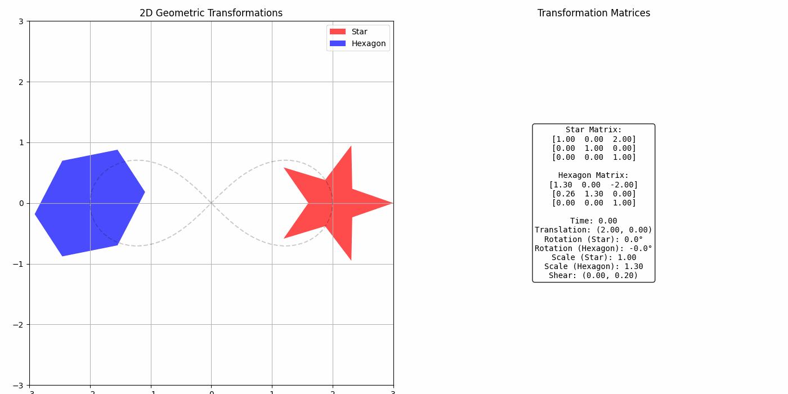
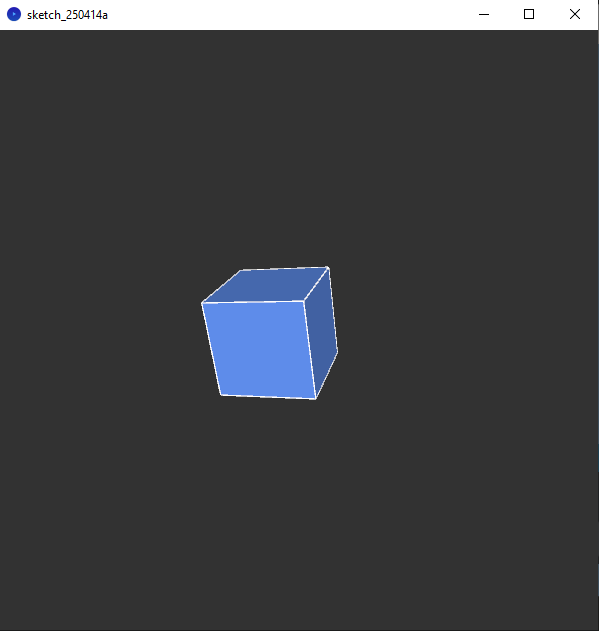
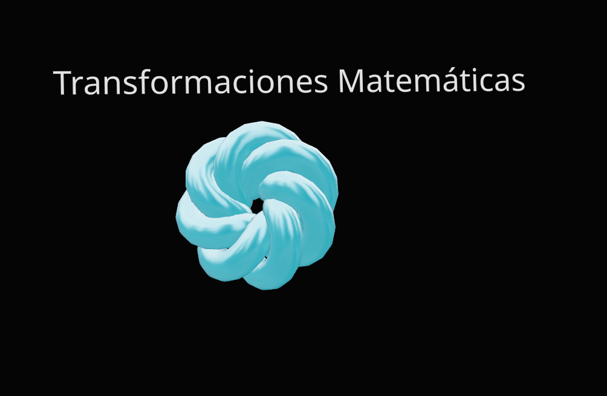

# Taller de Transformaciones Geométricas

Este repositorio contiene implementaciones de transformaciones geométricas básicas (traslación, rotación, escalado y cizalladura) en diferentes entornos: Python (con Matplotlib), Processing y Three.js (con React).

## 1. Implementación en Python/Matplotlib

### Descripción

Implementación en Python usando NumPy y Matplotlib que aplica transformaciones a figuras geométricas 2D (estrella y hexágono). Visualiza:

- Traslación en el plano 2D
- Rotación sobre su propio centro
- Escalado uniforme y no uniforme
- Transformaciones por matrices de shear (cizalladura)

### Características principales

- Utiliza matrices de transformación homogéneas (3x3)
- Muestra la matriz aplicada junto a la visualización
- Permite manipular parámetros de transformación individualmente
- Compara múltiples figuras con diferentes transformaciones

### Código relevante

```python
# Funciones para crear matrices de transformación
def traslacion_matriz(tx, ty):
    return np.array([
        [1, 0, tx],
        [0, 1, ty],
        [0, 0, 1]
    ])

def rotacion_matriz(angulo_grados):
    angulo_rad = np.radians(angulo_grados)
    cos_theta = np.cos(angulo_rad)
    sin_theta = np.sin(angulo_rad)
    return np.array([
        [cos_theta, -sin_theta, 0],
        [sin_theta,  cos_theta, 0],
        [0,          0,         1]
    ])

def escala_matriz(sx, sy):
    return np.array([
        [sx, 0,  0],
        [0,  sy, 0],
        [0,  0,  1]
    ])

def shear_matriz(shx, shy):
    return np.array([
        [1,   shx, 0],
        [shy, 1,   0],
        [0,   0,   1]
    ])

# Matrices específicas para cada figura
star_matrix = np.array([
    [1.00, 0.00, 2.00],
    [0.00, 1.00, 0.00],
    [0.00, 0.00, 1.00]
])

hexagon_matrix = np.array([
    [1.30, 0.00, -2.00],
    [0.26, 1.30, 0.00],
    [0.00, 0.00, 1.00]
])
```

### Resultado

La visualización muestra una estrella roja y un hexágono azul con sus respectivas matrices de transformación.



## 2. Implementación en Processing

### Descripción

Implementación en Processing que crea un cubo 3D animado con transformaciones básicas:

- Traslación en trayectoria sinusoidal
- Rotación en múltiples ejes
- Escalado cíclico

### Características principales

- Utiliza el modo 3D de Processing (P3D)
- Aplica iluminación para mejor visualización 3D
- Implementa sistema de transformaciones aisladas usando pushMatrix/popMatrix
- Genera animación continua basada en el tiempo

### Código relevante

```processing
void draw() {
  background(50);  // Fondo gris oscuro
  lights();        // Iluminación básica para visualizar el volumen 3D

  // Centrar el origen de coordenadas
  translate(width / 2, height / 2, 0);

  // Aislar transformaciones para el cubo
  pushMatrix();

  // Calcular tiempo y valores para las transformaciones
  float tiempoSegundos = millis() / 1000.0;

  // Traslación ondulada en eje X
  float amplitudOnda = 100.0;
  float frecuenciaOnda = 1.5;
  translate(amplitudOnda * sin(tiempoSegundos * frecuenciaOnda), 0, 0);

  // Rotación continua sobre ejes Y y X
  float velocidadRotacion = 0.01;
  rotateY(frameCount * velocidadRotacion);
  rotateX(frameCount * velocidadRotacion * 0.7);

  // Escalado cíclico entre 50% y 150%
  float frecuenciaEscala = 0.8;
  float factorEscala = (cos(tiempoSegundos * frecuenciaEscala) + 1) * 0.5 + 0.5;
  scale(factorEscala);

  // Dibujar el cubo
  fill(100, 150, 250);
  stroke(255);
  strokeWeight(1);
  box(80);

  // Restaurar sistema de coordenadas original
  popMatrix();
}
```

### Resultado

Una animación en tiempo real de un cubo 3D que se traslada horizontalmente, rota en múltiples ejes y cambia de tamaño cíclicamente.



## 3. Implementación en Three.js con React

### Descripción

Implementación en React Three Fiber (Three.js) que crea un nudo toroidal (Torus Knot) con transformaciones dinámicas:

- Traslación en una trayectoria compleja (combinación de senos y cosenos)
- Rotación continua en múltiples ejes
- Escalado pulsante

### Características principales

- Utiliza React Three Fiber para integrar Three.js con React
- Implementa materiales físicos avanzados con transmisión y reflectividad
- Anima propiedades del material (color, emisividad, transmisión) junto con las transformaciones
- Incorpora controles orbitales para navegación interactiva

### Código relevante

```javascript
useFrame((state, delta) => {
  const time = state.clock.elapsedTime;

  // Translation: Create a more complex path
  meshRef.current.position.x = Math.sin(time * 0.5) * Math.cos(time * 0.3) * 3;
  meshRef.current.position.z = Math.cos(time * 0.5) * 3;
  meshRef.current.position.y = Math.sin(time * 0.7) * 1.5;

  // Rotation: Incrementally rotate on all axes for more dynamic feel
  meshRef.current.rotation.x += delta * 0.2;
  meshRef.current.rotation.y += delta * 0.3;

  // Scaling: Smooth breathing-like scaling effect
  const scale = 1 + Math.sin(time * 0.8) * 0.2;
  meshRef.current.scale.set(scale, scale, scale);

  // Update material color based on time
  if (materialRef.current) {
    const hue = (time * 0.05) % 1;
    materialRef.current.color.setHSL(hue, 0.7, 0.5);
    materialRef.current.emissive.setHSL(hue, 1, 0.2);
    materialRef.current.transmission = 0.5 + Math.sin(time) * 0.2;
  }

  // Update geometry parameters over time if active
  if (active && meshRef.current.geometry instanceof THREE.TorusKnotGeometry) {
    // Only recreate the geometry periodically to avoid performance issues
    if (Math.floor(time * 2) % 5 === 0) {
      meshRef.current.geometry.dispose();
      const p = 2 + Math.floor(Math.sin(time * 0.2) * 3);
      const q = 3 + Math.floor(Math.cos(time * 0.2) * 4);
      meshRef.current.geometry = new THREE.TorusKnotGeometry(
        1.2, // radius
        0.4, // tube radius
        128, // tubular segments
        32, // radial segments
        p, // p
        q, // q
      );
    }
  }
});
```

### Resultado

Una aplicación web interactiva que muestra un nudo toroidal iridiscente que se mueve, rota y escala dinámicamente en un entorno 3D con iluminación realista.



## Ejecución

### Python/Matplotlib

1. Asegúrate de tener instalado Python con NumPy y Matplotlib
2. Ejecuta el script principal para ver la animación 2D

### Processing

1. Abre el archivo `basicTransformations.pde` con Processing
2. Presiona el botón Run

### Three.js (React)

1. Navega a la carpeta `threejsProject`
2. Instala las dependencias: `npm install`
3. Ejecuta el servidor de desarrollo: `npm run dev`
4. Abre el navegador en la URL indicada (generalmente http://localhost:5173)
