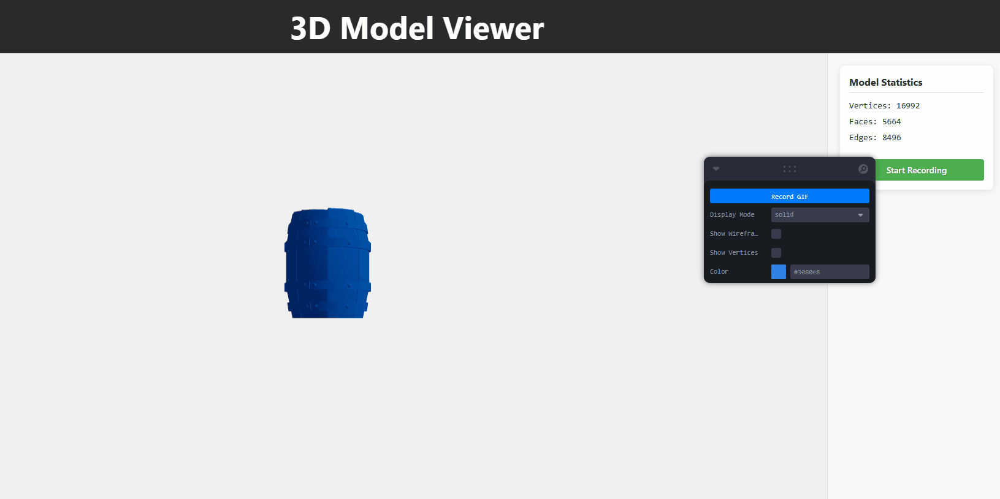

# Taller Estructuras 3D

## Fecha

`2025-05-03` -> Fecha de realización del taller

## Objetivo

Comprender las estructuras gráficas básicas que forman los modelos 3D (mallas poligonales) y visualizar su estructura en distintas plataformas. Se explorará la diferencia entre vértice, arista y cara, así como el contenido de formatos de archivo estándar de malla como `.OBJ`, `.STL` y `.GLTF`.

## Conceptos Aprendidos

1. **Estructura de una malla 3D**

   - Definición de **vértices**: puntos en el espacio 3D.
   - Definición de **aristas**: líneas que conectan pares de vértices.
   - Definición de **caras**: superficies formadas por tres o más aristas, comúnmente triángulos.

2. **Formatos de archivo de modelos 3D**

   - `.OBJ`, `.STL`, `.GLTF`: diferencias, estructura interna y compatibilidad con diferentes entornos.

3. **Visualización de mallas**

   - Representación de mallas en distintos modos:
     - **Wireframe** (solo aristas).
     - **Points** (solo vértices).
     - **Solid** (caras rellenadas).
   - Uso de herramientas de visualización interactiva como `OrbitControls`, `Edges`, `Points`, etc.

4. **Entornos de desarrollo multiplataforma**

   - Visualización en navegador con **React Three Fiber**.
   - Carga de modelos y controles de cámara con `@react-three/drei`.
   - Análisis estructural de modelos con scripts en TypeScript.
   - Visualización técnica y análisis en **Python** usando `trimesh`, `vedo`.

5. **Extracción de información estructural**
   - Cálculo del número de:
     - Vértices
     - Aristas
     - Caras
   - Acceso a propiedades geométricas del modelo 3D mediante código.

## Herramientas y Entornos

- **Python 3.x**

  - Librerías: `trimesh`, `vedo`, `numpy`, `matplotlib`
  - Entorno: Jupyter Notebook

- **React + TypeScript**
  - `@react-three/fiber`: Framework para Three.js en React
  - `@react-three/drei`: Utilidades para React Three Fiber
  - `three.js`: Biblioteca principal para gráficos 3D en la web
  - `leva`: Controles UI para ajustar parámetros

## Estructura del Proyecto

```
2025-05-03_taller_estructuras_3d/
├── python/              # Implementación Python
│   ├── visual_model.ipynb   # Jupyter notebook con visualización
│   ├── barril_rotacion.gif  # Animación exportada
│   └── Barrel_OBJ.obj       # Modelo 3D
├── threejs/             # Implementación React
│   ├── src/             # Código fuente
│   │   ├── App.tsx      # Componente principal
│   │   └── ...          # Otros archivos
│   ├── public/          # Archivos públicos
│   │   └── models/      # Modelos 3D
│   └── ...              # Configuración del proyecto
├── datos/               # Modelos compartidos
│   └── Barrel_OBJ.obj   # Modelo principal usado
└── README.MD            # Este archivo
```

## Implementación

### Python (trimesh + vedo)

En la implementación en Python, se utilizó un Jupyter Notebook (`visual_model.ipynb`) para:

1. Cargar el modelo 3D (`Barrel_OBJ.obj`) usando la biblioteca `trimesh`.
2. Extraer y visualizar componentes estructurales del modelo:
   - Vértices como puntos
   - Aristas como líneas
   - Caras como superficies coloreadas
3. Generar una animación de rotación del modelo y exportarla como GIF.

La visualización en `vedo` permitió explorar las diferentes representaciones del modelo y analizar su estructura.

### React + Three.js

La implementación web utiliza React con TypeScript y la biblioteca Three.js a través de React Three Fiber:

1. Carga el modelo 3D utilizando `OBJLoader` de Three.js.
2. Implementa diferentes modos de visualización (sólido, wireframe, puntos) mediante la librería `leva` para los controles UI.
3. Calcula y muestra estadísticas del modelo (número de vértices, aristas y caras).
4. Ofrece controles interactivos para manipular la cámara con `OrbitControls`.

Características clave:

- Visualización en tiempo real del modelo 3D
- Alternancia entre diferentes modos de visualización
- Estadísticas detalladas sobre la estructura del modelo
- Controles de cámara interactivos para explorar el modelo desde diferentes ángulos

## Resultados y Capturas

### Python - Visualización y Animación

La implementación en Python generó una visualización estática del modelo mostrando sus componentes estructurales, así como una animación de rotación


### React Three Fiber - Visualización Interactiva

La implementación web permitió una exploración interactiva del modelo con diferentes modos de visualización y estadísticas en tiempo real.



## Promps Usados

- "Quiero que me ayudes a crear un taller de transformaciones geométricas en 3D usando Python y React. El taller debe ser interactivo y visualizar los resultados en tiempo real."
- "Quiero que me generes una animacion de un barril rotando en 3D"
