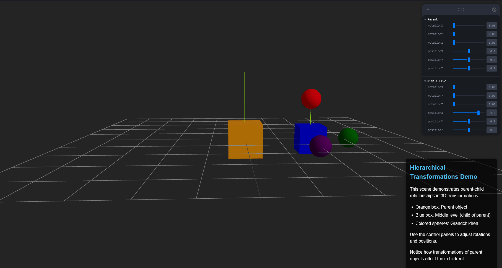

# 🧪 Taller - Jerarquías y Transformaciones

## 📅 Fecha

`2025-05-03` – Fecha de realización del taller

---

## 🎯 Objetivo del Taller

Aplicar estructuras jerárquicas y árboles de transformación para organizar escenas y simular movimiento relativo entre objetos. Se busca comprender **cómo** las transformaciones afectan a los nodos hijos en una estructura padre-hijo y cómo visualizar estos efectos en tiempo real.

---

## 🧠 Conceptos Aprendidos

- [x] Transformaciones geométricas (escala, rotación, traslación)
- [x] Shaders y efectos visuales
- [ ] Entrenamiento de modelos IA
- [ ] Comunicación por gestos o voz
- [x] Otro: Jerarquías padre-hijo en escenas 3D
- [x] Otro: Propagación de transformaciones desde objetos padres hacia sus hijos
- [x] Otro: Coordenadas locales vs. coordenadas globales

---

## 🔧 Herramientas y Entornos

- Three.js / React Three Fiber
- React para la interfaz de usuario
- React Three Drei para componentes útiles como OrbitControls
- Leva para crear paneles de control interactivos
- Vite como servidor de desarrollo y bundler

---

## 📁 Estructura del Proyecto

```
2025-03-05_taller_jerarquias_transformaciones/
├── README.md                  # Documentación del proyecto
├── resultado/
│   └── Jerarquia_transformaciones.gif  # Resultado visual del proyecto
└── threejs/                   # Implementación con Three.js
    ├── src/
    │   ├── App.tsx            # Componente principal con la escena 3D
    │   ├── main.tsx           # Punto de entrada de la aplicación
    │   └── ...                # Otros archivos de estilos y configuración
    ├── package.json           # Dependencias del proyecto
    └── ...                    # Otros archivos de configuración
```

---

## 🧪 Implementación

### 🔹 Etapas realizadas

1. Creación de una escena 3D con una estructura jerárquica de tres niveles
2. Implementación de controles interactivos para manipular la posición y rotación
3. Visualización de sistemas de coordenadas locales con ayudantes de ejes
4. Demostración de la propagación de transformaciones a través de la jerarquía

### 🔹 Código relevante

```tsx
// Estructura Jerárquica
<group
  position={[
    parentControls.positionX,
    parentControls.positionY,
    parentControls.positionZ,
  ]}
  rotation={[
    parentControls.rotationX,
    parentControls.rotationY,
    parentControls.rotationZ,
  ]}
>
  {/* Parent box */}
  <mesh>
    <boxGeometry args={[1, 1, 1]} />
    <meshStandardMaterial color="orange" />
  </mesh>

  {/* Middle level (child of parent, parent of grandchildren) */}
  <group
    position={[
      middleLevelControls.positionX,
      middleLevelControls.positionY,
      middleLevelControls.positionZ,
    ]}
    rotation={[
      middleLevelControls.rotationX,
      middleLevelControls.rotationY,
      middleLevelControls.rotationZ,
    ]}
  >
    {/* Middle level box */}
    <mesh>
      <boxGeometry args={[0.8, 0.8, 0.8]} />
      <meshStandardMaterial color="blue" />
    </mesh>

    {/* Grandchild objects */}
    <mesh position={[1.2, 0, 0]}>
      <sphereGeometry args={[0.3, 16, 16]} />
      <meshStandardMaterial color="green" />
    </mesh>
    {/* ...más nietos... */}
  </group>
</group>
```

---

## 📊 Resultados Visuales

### 📌 Demostración de Jerarquías y Transformaciones:



El GIF muestra cómo:

- Al manipular los controles del objeto padre (naranja), toda la jerarquía se mueve como una unidad
- Al modificar el nivel intermedio (cubo azul), sólo éste y sus hijos (las esferas) son afectados
- Las esferas mantienen sus posiciones relativas al cubo azul independientemente de las transformaciones aplicadas

---

## 🧩 Prompts Usados

```text
"Quiero que escanees el projecto y revises el package.json y encuentres las dependencias necesarias y posteriormente quiero que ejecutes la tarea realizando codigo limpio, quiero que actues como un programador senior."
```

---

## 💬 Reflexión Final

Este taller ha permitido explorar y comprender en profundidad cómo funcionan las jerarquías y transformaciones en entornos 3D. A través de la implementación de una estructura padre-hijo-nieto, se ha demostrado visualmente cómo las transformaciones (rotaciones y traslaciones) aplicadas a un objeto padre se propagan a todos sus descendientes, manteniendo las relaciones espaciales relativas entre ellos.

La parte más interesante fue observar cómo los cambios en un nivel de la jerarquía afectan a todos los elementos dependientes, creando una cadena de transformaciones que permite construir sistemas complejos a partir de relaciones sencillas. Esta estructura es fundamental en animación, desarrollo de videojuegos y simulaciones 3D.

En futuros proyectos, aplicaría este conocimiento para crear sistemas de animación más complejos, como personajes articulados o maquinaria con partes móviles interconectadas. También exploraría la posibilidad de combinar estas jerarquías con físicas para crear simulaciones más realistas.
