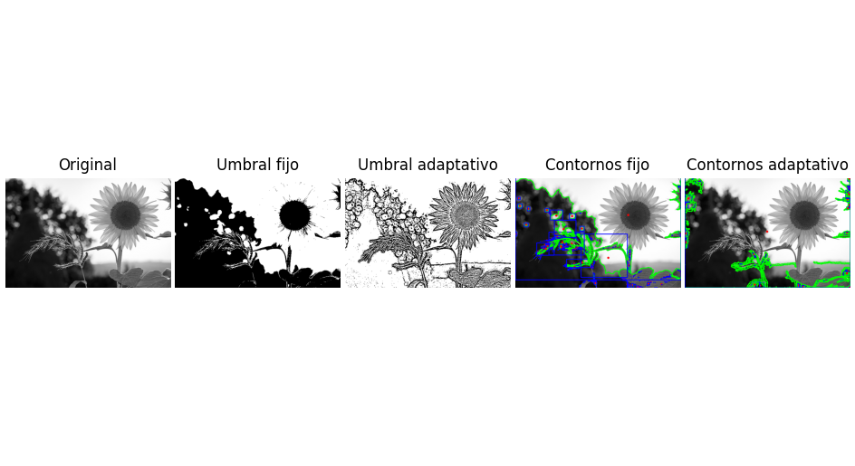

# 🧪 Taller de Segmentación de Formas

## 📅 Fecha

`2025-05-03` – Fecha de entrega o realización

---

## 🎯 Objetivo del Taller

Aplicar técnicas básicas de segmentación en imágenes mediante umbralización y detección de formas simples. El objetivo es comprender cómo identificar regiones de interés en imágenes mediante procesos de binarización y **análisis** morfológico.

## 🧠 Conceptos Aprendidos

Lista los principales conceptos aplicados:

- 📷 **Carga y procesamiento de imágenes en escala de grises** utilizando OpenCV.
- 🎛️ **Segmentación binaria** de imágenes mediante:
  - Umbral fijo con `cv2.threshold`.
  - Umbral adaptativo con `cv2.adaptiveThreshold`.
- 🔍 **Detección de contornos** con `cv2.findContours`.
- 🎯 **Cálculo del centro de masa** de formas detectadas usando `cv2.moments`.
- 🟦 **Dibujo de contornos y bounding boxes** con `cv2.drawContours` y `cv2.boundingRect`.
- 📏 **Cálculo de métricas básicas** como número de formas, área promedio y perímetro promedio.
- 🖼️ **Visualización de imágenes y resultados** con `matplotlib`.
- 📹 **Captura y procesamiento de imágenes en tiempo real desde webcam** usando OpenCV en un entorno de notebook.

---

## 🔧 Herramientas y Entornos

Especifica los entornos usados:

- Python (opencv-python, numpy, matplotlib)
- Jupyter Notebook o Google Colab
- OpenCV para procesamiento de imágenes y video

---

## 📁 Estructura del Proyecto

```
YYYY-MM-DD_nombre_taller/
├── python/                # Contiene notebooks y scripts de Python
│   └── segmentacion_imagenes.ipynb  # Notebook principal
├── image/                 # Directorio con imágenes de entrada
│   └── sunflower.jpg      # Imagen de prueba
├── resultados/            # Capturas, métricas, gifs de la segmentación
├── README.md              # Documentación del proyecto
```

---

## 🧪 Implementación

Explica el proceso:

### 🔹 Etapas realizadas

1. **Preparación de datos**: Carga de imágenes en escala de grises utilizando OpenCV.
2. **Aplicación de algoritmos**:
   - Umbralización fija y adaptativa para binarizar imágenes
   - Detección de contornos en las imágenes binarias
   - Cálculo de métricas sobre las formas detectadas (área, perímetro)
3. **Visualización**: Dibujo de contornos, centros de masa y rectángulos delimitadores
4. **Procesamiento en tiempo real**: Captura y procesamiento de video desde webcam

### 🔹 Código relevante

```python
# Procesamiento básico de imagen
img_gray = load_image_gray(image_path)
bin_fixed = fixed_threshold(img_gray)
bin_adapt = adaptive_threshold(img_gray)

# Detección de contornos y cálculo de métricas
cont_fixed = find_contours(bin_fixed)
cont_adapt = find_contours(bin_adapt)
met_fixed = compute_metrics(cont_fixed)
met_adapt = compute_metrics(cont_adapt)

# Función para dibujar contornos y calcular centros de masa
def draw_contours_and_metrics(image: np.ndarray, contours: List[np.ndarray]) -> np.ndarray:
    output = cv2.cvtColor(image, cv2.COLOR_GRAY2BGR) if image.ndim == 2 else image.copy()
    for cnt in contours:
        cv2.drawContours(output, [cnt], -1, (0, 255, 0), 2)
        M = cv2.moments(cnt)
        if M.get("m00", 0) != 0:
            cx, cy = int(M["m10"]/M["m00"]), int(M["m01"]/M["m00"])
            cv2.circle(output, (cx, cy), 4, (0, 0, 255), -1)
        x, y, w, h = cv2.boundingRect(cnt)
        cv2.rectangle(output, (x, y), (x+w, y+h), (255, 0, 0), 2)
    return output
```

---

## 📊 Resultados Visuales




---

## 🧩 Prompts Usados

- Explícame la diferencia entre umbral fijo y umbral adaptativo en OpenCV.
- ¿Cómo puedo detectar y contar objetos en tiempo real usando una webcam con OpenCV?
- ¿Cómo se calculan los momentos de una forma y qué representan?

---

## 💬 Reflexión Final

Este taller me ayudó a entender mejor cómo segmentar imágenes y detectar formas usando OpenCV. Pude comparar el umbral fijo y adaptativo, y aprender cómo extraer información como contornos, centros y áreas. Al principio me costó ajustar bien los parámetros, pero fue interesante ver cómo cambia el resultado según la imagen. En general, fue una buena forma de aplicar teoría de visión por computadora de manera práctica.

