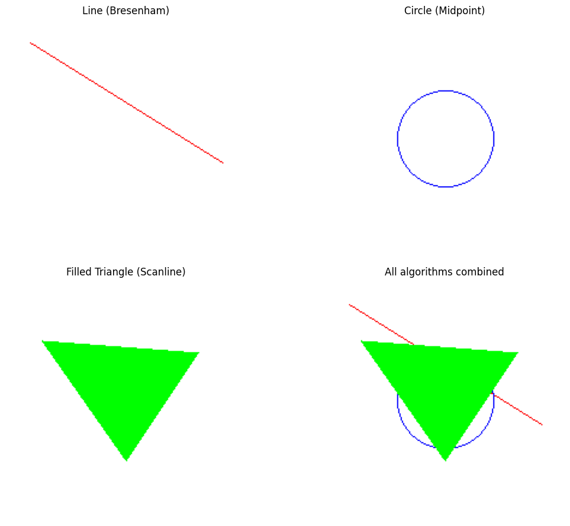

# 🧪 Algoritmos de Rasterización Básica

## 📅 Fecha

`2025-05-04` – Fecha de realización

---

## 🎯 Objetivo del Taller

## Comprender e implementar los algoritmos clásicos de rasterización para líneas, círculos y triángulos, entendiendo cómo se construyen imágenes píxel a píxel en una pantalla. El objetivo es desarrollar una base sólida sobre cómo se generan primitivas gráficas sin usar librerías de alto nivel.

## 🧠 Conceptos Aprendidos

- Rasterización de primitivas: Comprensión de cómo se dibujan líneas, círculos y triángulos píxel a píxel.

- Algoritmo de Bresenham para líneas: Cálculo de la trayectoria óptima de píxeles para una línea eficiente y sin artefactos.
- Algoritmo de punto medio para círculos: Uso de decisiones basadas en una función de error para trazar círculos con simetría de octantes.
- Rasterización de triángulos por scanline: Relleno de triángulos mediante escaneo horizontal entre bordes interpolados.

---

## 🔧 Herramientas y Entornos


- Python (`Pillow`, `matplotlib`)
- Jupyter Notebook
---

## 📁 Estructura del Proyecto

```
2025-05-04_taller_algoritmos_rasterizacion_basica/
├── python/                # Implementación de algoritmos en Python
│   └── algorithms_rasterization.ipynb    # Notebook con los algoritmos
├── results/               # Resultados visuales
│   └── output.png         # Imagen con los resultados
│   └── output.png         # Imagen con los **resultados**
├── README.md              # Documentación del proyecto
```


---

## 🧪 Implementación

Explica el proceso:

### 🔹 Etapas realizadas

1. Implementación del algoritmo de Bresenham para rasterización de líneas
2. Implementación del algoritmo del punto medio para círculos
3. Implementación del algoritmo de scanline para relleno de triángulos
4. Visualización y combinación de todos los algoritmos

### 🔹 Código relevante

Incluye un fragmento que resuma el corazón del taller:

```python
# Algoritmo de **Bresenham** para líneas
def bresenham(x0, y0, x1, y1, pixels):
    dx = abs(x1 - x0)
    dy = abs(y1 - y0)
    sx = 1 if x0 < x1 else -1
    sy = 1 if y0 < y1 else -1
    err = dx - dy
    x, y = x0, y0

    while True:
        pixels[x, y] = (255, 0, 0)  # Red
        if x == x1 and y == y1:
            break
        e2 = 2 * err
        if e2 > -dy:
            err -= dy
            x += sx
        if e2 < dx:
            err += dx
            y += sy

# Algoritmo del punto medio para círculos
def midpoint_circle(x0, y0, radius, pixels):
    x = radius
    y = 0
    p = 1 - radius  # Parámetro inicial de decisión

    plot_circle_points(x0, y0, x, y, pixels)
    while x >= y:
        y += 1
        if p <= 0:
            p = p + 2*y + 1
        else:
            x -= 1
            p = p + 2*y - 2*x + 1
        if x < y:
            break
        plot_circle_points(x0, y0, x, y, pixels)
```

---

## 📊 Resultados Visuales

### 📌 Implementación de los algoritmos de rasterización:

En el siguiente video se muestra la implementación de los algoritmos de rasterización:




La imagen muestra los resultados de los tres algoritmos implementados:

1. Línea usando el algoritmo de Bresenham (rojo)
2. Círculo usando el algoritmo del punto medio (azul)
3. Triángulo relleno usando el algoritmo de scanline (verde)
4. Combinación de todos los algoritmos

---

## 🧩 Prompts Usados
- ¿Cómo implementar el algoritmo de Bresenham en Python paso a paso?
- Explica la lógica del algoritmo de punto medio para círculos y proporciona un ejemplo en código.
- ¿Cómo ordenar vértices de un triángulo para simplificar la rasterización por scanline?
- ¿Qué funciones de Pillow son necesarias para manipular píxeles directamente?

---

## 💬 Reflexión Final
Implementar estos algoritmos revela el contraste entre decisiones incrementales y enfoques geométricos. Bresenham evita multiplicaciones usando solo sumas y comparaciones, óptimo para hardware limitado. El punto medio para círculos incorpora un error incremental y aprovecha la simetría de octantes para un buen balance entre precisión y velocidad. El método scanline para triángulos simplifica el relleno mediante interpolación lineal, aunque puede requerir ajustes en triángulos muy grandes. En conjunto, Bresenham y el punto medio ofrecen alto rendimiento, mientras que el scanline es más sensible al tamaño de la forma.

---
