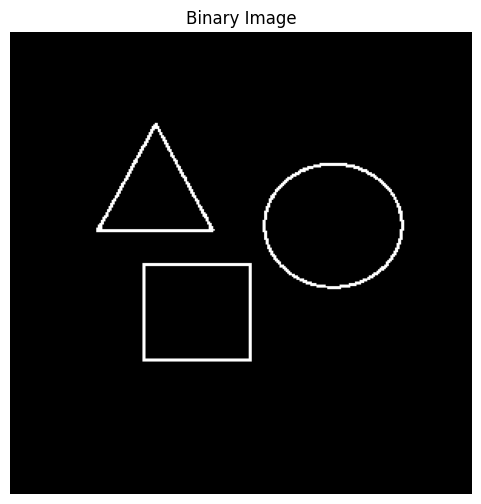
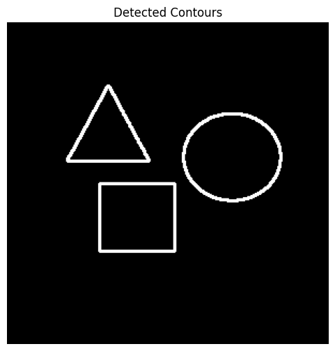
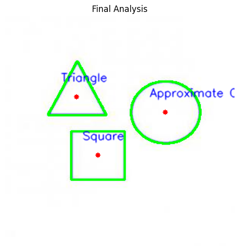
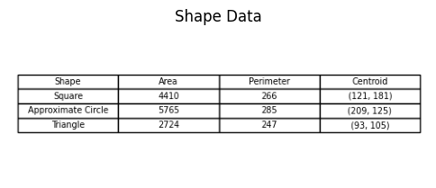

# 🧪 Análisis de Figuras Geométricas

## 📅 Fecha

`2025-05-04` – Fecha de entrega o realización

---

## 🎯 Objetivo del Taller

Detectar formas simples (círculos, cuadrados, triángulos) en imágenes binarizadas y calcular propiedades geométricas como área, perímetro y centroide. El objetivo es desarrollar habilidades para extraer métricas relevantes de contornos detectados en imágenes procesadas.

---

## 🧠 Conceptos Aprendidos

- Lectura y visualización de imágenes en escala de grises y binarizadas (cv2.imread, cv2.cvtColor, cv2.threshold).

- Manejo de imágenes binarizadas para facilitar la detección de formas.

- Uso de cv2.findContours() para extraer contornos en imágenes binarizadas.

- Jerarquía de contornos y modos de recuperación (RETR_EXTERNAL, RETR_TREE, etc.).

- Estructura de los contornos como listas de coordenadas.

---

## 🔧 Herramientas y Entornos

- Python: Lenguaje de programación utilizado para el análisis de imágenes.
- OpenCV: Biblioteca utilizada para la manipulación y procesamiento de imágenes.
- NumPy: Biblioteca para el manejo de arreglos y operaciones matemáticas.
- Matplotlib: Biblioteca para la visualización de datos y gráficos.
- Pandas: Biblioteca para la manipulación y análisis de datos.

---

## 📁 Estructura del Proyecto

El proyecto se organiza de la siguiente manera:

```
2025-05-04_taller_analisis_figuras_geometricas/
│
├── README.md                # Documentación del taller
├── python/
│   ├── figure_geometric.ipynb   # Notebook principal con el análisis y visualización
│   └── Figura.jpg               # Imagen de entrada utilizada para el análisis
├── results/
│   ├── tabla_resultado.png      # Imagen de la tabla con los resultados de las figuras detectadas
│   ├── resultado1.png           # Ejemplo de salida visual (contornos, etiquetas, etc.)
│   ├── resultado2.png           # Ejemplo de salida visual
│   └── resultado3.png           # Ejemplo de salida visual
```

---

## 🧪 Implementación

El flujo de trabajo implementado en el notebook principal es el siguiente:

1. **Carga y preprocesamiento de la imagen**  
   Se carga la imagen de entrada (`Figura.jpg`), se convierte a escala de grises y se binariza para facilitar la detección de formas.

2. **Detección de contornos**  
   Se utilizan las funciones de OpenCV para encontrar los contornos de las figuras presentes en la imagen binarizada.

3. **Análisis geométrico de las figuras**  
   Para cada contorno detectado, se calcula el área, perímetro y centroide. Además, se determina el tipo de figura (triángulo, cuadrado, círculo aproximado) según el número de vértices.

4. **Visualización de resultados**  
   Se dibujan los contornos y centroides sobre la imagen original, y se etiquetan las figuras detectadas.  
   Los resultados se almacenan en un DataFrame y se exportan como una imagen de tabla (`tabla_resultado.png`).  
   También se generan imágenes de salida con los resultados visuales en la carpeta `results/`.

### 🔹 Código relevante

Incluye un fragmento que resuma el corazón del taller:

```python
import cv2
import numpy as np
import matplotlib.pyplot as plt
import pandas as pd

# Cargar y binarizar la imagen
image = cv2.imread('figura.jpg')
gray = cv2.cvtColor(image, cv2.COLOR_BGR2GRAY)
_, thresh = cv2.threshold(gray, 127, 255, cv2.THRESH_BINARY_INV)

# Encontrar contornos
contours, _ = cv2.findContours(thresh.copy(), cv2.RETR_EXTERNAL, cv2.CHAIN_APPROX_SIMPLE)

# Analizar y clasificar figuras
shape_data = []
for cnt in contours:
    area = cv2.contourArea(cnt)
    peri = cv2.arcLength(cnt, True)
    approx = cv2.approxPolyDP(cnt, 0.04 * peri, True)
    vertices = len(approx)
    if vertices == 3:
        shape = 'Triángulo'
    elif vertices == 4:
        x, y, w, h = cv2.boundingRect(approx)
        shape = 'Cuadrado' if abs(w-h) < 0.1*max(w,h) else 'Rectángulo'
    elif vertices > 4:
        shape = 'Círculo Aproximado'
    else:
        shape = 'Desconocido'
    M = cv2.moments(cnt)
    cx = int(M['m10']/M['m00']) if M['m00'] != 0 else 0
    cy = int(M['m01']/M['m00']) if M['m00'] != 0 else 0
    shape_data.append([shape, int(area), int(peri), (cx, cy)])

# Mostrar resultados en DataFrame
import pandas as pd
df = pd.DataFrame(shape_data, columns=['Figura', 'Área', 'Perímetro', 'Centroide'])
print(df)
```


## 📊 Resultados Visuales

A continuación se presentan los resultados obtenidos en la ejecución del código:

### Imagen Binaria


### Imagen con Contornos


### Imagen con Contornos y Centroside


### Tabla de Resultados


---

## 🧩 Prompts Usados

- Dame un ejemplo de cómo cargar una imagen en escala de grises con OpenCV y binarizarla usando `cv2.threshold()`.
- ¿Cómo puedo detectar contornos en una imagen binarizada usando OpenCV (`cv2.findContours`) y dibujarlos sobre una copia de la imagen original?
- ¿Cómo puedo clasificar automáticamente una figura detectada como triángulo, cuadrado o círculo usando `cv2.approxPolyDP()` y el número de vértices?
- Dame un ejemplo de cómo dibujar los contornos detectados en una imagen y etiquetar cada uno con su área, perímetro y coordenadas del centroide.


## 💬 Reflexión Final

Con este taller aprendí a utilizar herramientas de procesamiento de imágenes como OpenCV para detectar y analizar figuras geométricas simples en imágenes binarizadas. Reforcé conocimientos sobre cómo extraer propiedades geométricas como el área, perímetro y centroide de contornos, y cómo visualizar esta información directamente sobre la imagen. También comprendí mejor cómo se calculan los momentos de una figura y cómo se utilizan para obtener el centroide, lo cual fue especialmente útil para tareas de análisis y clasificación.

La parte más interesante fue implementar la clasificación automática de figuras utilizando cv2.approxPolyDP() para contar vértices y distinguir entre triángulos, cuadrados y círculos aproximados. Fue un reto encontrar el equilibrio adecuado en los parámetros de aproximación para obtener resultados precisos, especialmente con figuras que no eran perfectas. Para futuros proyectos, me gustaría mejorar la robustez de la clasificación y aplicar estas técnicas en escenarios reales, como análisis de planos o reconocimiento de patrones en imágenes más complejas. También exploraría la posibilidad de combinar estos métodos con modelos de machine learning para ampliar su alcance.
