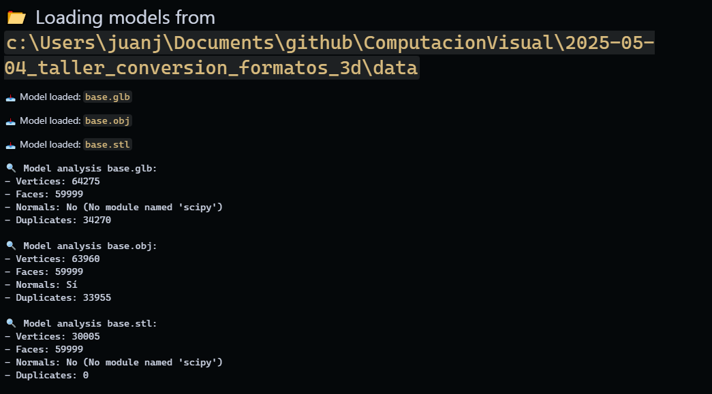
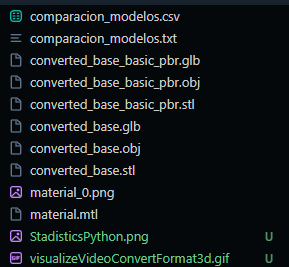

# 🧪 Visualización y Conversión de Formatos 3D

## 📅 Fecha

`2025-05-06` – Fecha de realización

---

## 🎯 Objetivo del Taller

Comparar y convertir entre distintos formatos de modelos 3D: .OBJ, .STL y .GLTF, y visualizar sus diferencias en geometría y materiales. El objetivo es entender la estructura interna de los archivos 3D, su compatibilidad entre entornos, y cómo se interpretan en distintas plataformas de visualización.

---

## 🧠 Conceptos Aprendidos

- Estructura interna y diferencias entre .OBJ, .STL y .GLTF:
  - .OBJ: contiene geometría y puede tener archivos MTL para materiales.
  - .STL: solo geometría, sin colores ni texturas.
  - .GLTF: formato moderno, compacto, soporta animaciones, materiales y texturas.
- Compatibilidad entre formatos:
  - .OBJ y .STL son muy comunes en muchos programas de modelado y animación.
  - .GLTF es más nuevo y compatible con múltiples plataformas y herramientas de visualización.
- Visualización en Python:
  - Usar Trimesh para cargar y visualizar .OBJ y .STL.
  - Usar Open3D para visualizar .GLTF.
  - Uso de funciones como mesh.vertices, mesh.faces, mesh.show(), etc.
- Visualización en Three.js:
  - Usar React Three Fiber para crear una interfaz de usuario interactiva.
  - Uso de useLoader para cargar .OBJ, .STL y .GLTF.
  - Uso de Three.js para crear una escena 3D.
  - Uso de useEffect para controlar la carga de modelos.

---

## 🔧 Herramientas y Entornos

- Python:

  - `trimesh`: Para manipulación y conversión de modelos 3D
  - `numpy`: Para procesamiento de datos
  - `pandas`: Para análisis y visualización de resultados
  - `matplotlib`: Para visualización estática
  - `open3d`: Para visualización interactiva
  - Jupyter Notebook: Para análisis interactivo

- Three.js:
  - React Three Fiber: Framework para React con Three.js
  - @react-three/drei: Herramientas adicionales para React Three Fiber
  - TypeScript: Para desarrollo seguro
  - Vite: Para desarrollo rápido

---

## 📁 Estructura del Proyecto

```
2025-05-04_taller_conversion_formatos_3d/
├── python/                # Implementación con Python
│   ├── formatConversion3D.ipynb
│   ├── VisualizationImage3d-1.png
│   ├── VisualizationImage3d-2.png
│   └── VisualizationImage3d-3.png
├── threejs/               # Implementación con React Three Fiber
│   ├── src/
│   │   ├── components/
│   │   │   ├── ModelViewer.tsx
│   │   │   └── ModelInfoPanel.tsx
│   │   ├── App.tsx
│   │   ├── App.css
│   │   ├── index.css
│   │   ├── main.tsx
│   │   └── vite-env.d.ts
│   ├── results/
│   │   └── VisualizeConvertFormat3d.gif
│   └── public/
├── data/                  # Modelos 3D originales
│   ├── base.obj
│   ├── base.stl
│   └── base.glb
├── resultados/            # Resultados de conversión
│   ├── converted_base.obj
│   ├── converted_base.stl
│   ├── converted_base.glb
│   ├── converted_base_basic_pbr.obj
│   ├── converted_base_basic_pbr.stl
│   ├── converted_base_basic_pbr.glb
│   ├── visualizeVideoConvertFormat3d.gif
│   ├── resultsFiles.png
│   ├── StadisticsPython.png
│   ├── comparacion_modelos.csv
│   ├── comparacion_modelos.txt
│   ├── material.mtl
│   └── material_0.png
└── README.md
```

---

## 🧪 Implementación

### 🔹 Etapas realizadas

1. **Carga y análisis de modelos 3D**

   - Carga de modelos en diferentes formatos (.obj, .stl, .glb)
   - Análisis de geometría (vértices, caras, normales)
   - Comparación de características de cada formato

2. **Conversión entre formatos**

   - Conversión desde cada formato a los demás
   - Preservación de geometría y, cuando sea posible, materiales

3. **Visualización de modelos**

   - Visualización estática con Matplotlib
   - Visualización interactiva con Open3D
   - Visualización web con React Three Fiber

4. **Análisis comparativo**
   - Comparación estadística de modelos
   - Guardado de resultados en CSV y visualizaciones

### 🔹 Código relevante

**Python (Trimesh para análisis y conversión):**

```python
# Análisis básico de un modelo 3D
def analizar_modelo(modelo, nombre):
    resultados = {"Nombre": nombre}

    # Convertir escena a mesh si es necesario
    if isinstance(modelo, trimesh.Scene):
        if not modelo.geometry:
            print(f"⚠️ Scene {nombre} is empty")
            return None
        modelo = trimesh.util.concatenate([mesh for mesh in modelo.geometry.values()])

    resultados["Vértices"] = len(modelo.vertices)
    resultados["Caras"] = len(modelo.faces)

    # Verificar normales
    try:
        _ = modelo.vertex_normals
        resultados["Normales"] = "Sí"
    except Exception as e:
        resultados["Normales"] = f"No ({str(e)})"

    return modelo, resultados
```

**Three.js (React Three Fiber para visualización web):**

```typescript
// Carga de modelos 3D en diferentes formatos
const objModel = useLoader(OBJLoader, '/models/base.obj');
const stlGeometry = useLoader(STLLoader, '/models/base.stl');
const glbModel = useLoader(GLTFLoader, '/models/base.glb');

// Convertir STL geometry en mesh con material mejorado
const stlMesh = new THREE.Mesh(
  stlGeometry,
  new THREE.MeshPhysicalMaterial({
    color: 'rgb(180, 180, 190)',
    metalness: 0.2,
    roughness: 0.3,
    clearcoat: 0.4,
    clearcoatRoughness: 0.2,
    envMapIntensity: 1.5,
  }),
);
```

### 📊 Resultados Visuales

**Visualización Python:**


**Estadisticas al ejecutar el codigo:**



**Resultado de la transformacion de los modelos:**



**Visualización Three.js:**


---

## 🧩 Prompts Usados

- Cárgame un modelo 3D en formato .OBJ usando Trimesh y dime cuántos vértices, caras y normales tiene.
- ¿Puedes detectar vértices duplicados en este modelo cargado con Open3D?
- Carga modelos en .OBJ, .STL y .GLTF y haz una tabla comparando vértices, caras y si tienen normales o no.
- Convierte un archivo .OBJ a .GLTF usando Trimesh o Assimp en Python.
- Crea un script en Python que recorra una carpeta con modelos 3D y genere un CSV con los datos de vértices, caras y si hay duplicados.
- Muéstrame cómo cargar un modelo .GLTF en una escena con React Three Fiber.
- Haz un ejemplo en React Three Fiber donde pueda alternar entre modelos .OBJ, .STL y .GLTF con un botón.

---

## 💬 Reflexión Final

En este taller aprendí a comparar y convertir modelos 3D entre formatos como .OBJ, .STL y .GLTF, usando Python y herramientas como trimesh y open3d. Me ayudó a entender mejor cómo están estructurados estos archivos y qué información contienen, como vértices, caras y normales.

Lo más interesante fue ver cómo cambian los modelos visualmente según el formato y el visor. La parte más complicada fue mantener los materiales al convertir entre formatos, especialmente con .GLTF. En el futuro, me gustaría aplicar esto para automatizar análisis de modelos y mejorar la visualización de archivos 3D en proyectos web o de videojuegos.

---
