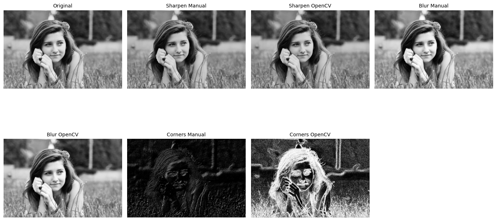

# 🧪 Convoluciones Personalizadas

## 📅 Fecha

`2025-05-04` – Fecha de realización

---

## 🎯 Objetivo del Taller

Diseñar e implementar filtros personalizados en imágenes para modificar bordes, difuminar o realzar detalles. Este taller busca profundizar en el concepto de convolución y su impacto visual en el procesamiento de imágenes.

---

## 🧠 Conceptos Aprendidos

- Convolución 2D manual con NumPy para aplicar filtros a imágenes.

- Diseño de kernels personalizados (enfoque, desenfoque, bordes).

- Diferencia entre implementación manual y uso de cv2.filter2D.

- Visualización y comparación de resultados con matplotlib.

- Interactividad opcional con sliders usando cv2.createTrackbar.

---

## 🔧 Herramientas y Entornos

- Python (`opencv-python`, `numpy`, `matplotlib`, `tkinter`)
- Jupyter Notebook

---

## 📁 Estructura del Proyecto

```
2025-05-04_taller_convoluciones_personalizadas/
├── python/
│ ├── convolution.ipynb
│ └── imagen.jpg
├── resultados/
│ ├── convolution.gif
│ └── resultado.png
├── README.md
└── README.md
```

---

## 🧪 Implementación

El núcleo del taller consiste en aplicar convoluciones 2D manuales y con OpenCV para comparar resultados, además de una interfaz interactiva para modificar el kernel de enfoque.

### 🔹 Etapas realizadas

- Carga de imagen en escala de grises.
- Definición de kernels personalizados: enfoque, desenfoque, Sobel (bordes).
- Implementación de convolución manual usando NumPy para aplicar los kernels.
- Comparación con los resultados de cv2.filter2D y Sobel de OpenCV.
- Visualización de los resultados lado a lado con Matplotlib.
- Interfaz interactiva (Tkinter) para modificar el kernel de enfoque en tiempo real.

### 🔹 Código relevante

```python
# Convolución manual 2D
def convolve2d_manual(image, kernel):
    kh, kw = kernel.shape
    pad_h, pad_w = kh // 2, kw // 2
    padded = np.pad(image, ((pad_h, pad_h), (pad_w, pad_w)), mode='reflect')
    windows = np.lib.stride_tricks.sliding_window_view(padded, (kh, kw))
    output = np.sum(windows * kernel, axis=(-2, -1))
    output = np.clip(output, 0, 255)
    return output.astype(np.uint8)

# Ejemplo de uso
img_sharpen_manual = convolve2d_manual(img, kernel_sharpen)
img_blur_manual = convolve2d_manual(img, kernel_blur)
```

---

## 📊 Resultados Visuales

Resultados de la convolución manual y con OpenCV.

## Resultado


### 🔹 Resultado OpenCV y Manual



---

## 🧩 Prompts Usados

- ¿Cómo cargo una imagen en escala de grises usando OpenCV y la muestro con matplotlib?
- ¿Cómo implemento desde cero una función de convolución 2D en NumPy?
- ¿Cómo comparo los resultados de una convolución manual con la función filter2D de OpenCV?
- ¿Cómo creo una interfaz interactiva con Tkinter para modificar el kernel de enfoque en tiempo real?

---

## 💬 Reflexión Final

Con este taller aprendí a profundidad cómo funciona la operación de convolución en el procesamiento de imágenes y cómo afecta visualmente a una imagen según el tipo de kernel aplicado. Reforcé mi comprensión sobre cómo los filtros pueden detectar bordes, suavizar o realzar detalles, y lo importante que es entender el comportamiento de cada matriz de convolución. Implementar esta lógica manualmente con NumPy me permitió comprender lo que ocurre “detrás de cámaras” cuando usamos funciones de alto nivel como cv2.filter2D().

La parte más interesante fue diseñar mis propios kernels y ver los resultados visuales que generaban, especialmente al comparar el efecto de mis filtros con los que ofrece OpenCV. También fue un reto aplicar correctamente el padding y recorrer la imagen sin errores de índices, pero eso me ayudó a entender mejor cómo se procesan los píxeles. Para futuros proyectos, me gustaría experimentar con filtros más avanzados o incluso dinámicos, y definitivamente mejoraría la visualización incluyendo interfaces interactivas con sliders para ajustar los valores del kernel en tiempo real. Esto haría más intuitivo el análisis visual y más práctico el ajuste de parámetros.

---
