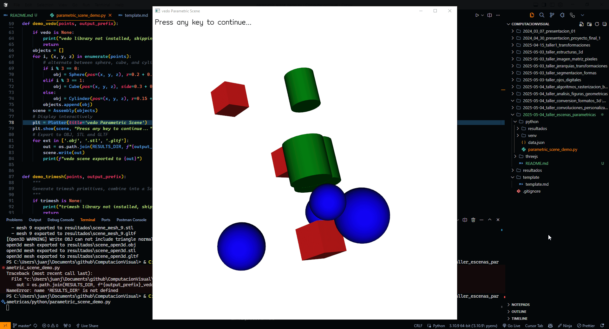
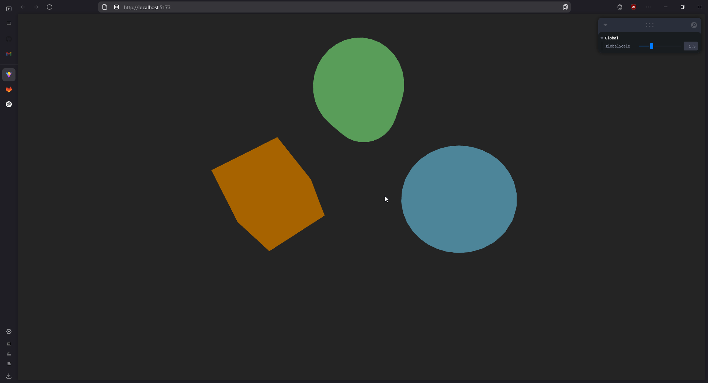

# 🧪 Taller Escenas Parametricas

## 📅 Fecha

`2025-05-04` – Fecha de realización

---

## 🎯 Objetivo del Taller

Generar objetos 3D de manera programada a partir de listas de coordenadas o datos estructurados. El propósito es entender cómo crear geometría en tiempo real y de forma flexible mediante código, utilizando bucles, estructuras condicionales y exportando o renderizando las escenas generadas.

---

## 🧠 Conceptos Aprendidos

Lista los principales conceptos aplicados:

- [ ] Transformaciones geométricas (escala, rotación, traslación)
- [ ] Segmentación de imágenes
- [ ] Shaders y efectos visuales
- [ ] Entrenamiento de modelos IA
- [ ] Comunicación por gestos o voz
- [ ] Otro: **********\_\_\_**********

---

## 🔧 Herramientas y Entornos

- Python 3.x: numpy, pandas, vedo, trimesh, open3d
- Node.js + npm: React, TypeScript, @react-three/fiber, drei, leva, **vite**
- Vite: bundler para desarrollo web
- Leva: panel de control de parámetros en interfaz
- Git: control de versiones

---

## 📁 Estructura del Proyecto

```
2025-05-04_taller_escenas_parametricas/
├── python/
│   ├── parametric_scene_demo.py   # Script principal de generación 3D
│   ├── data.json                  # Conjunto de puntos de ejemplo
│   └── resultados/                # OBJ, STL, GLTF exportados
├── threejs/
│   ├── src/
│   │   ├── components/Scene.tsx    # Componente React Three Fiber
│   │   └── constants/Objectd3d.ts  # Definición de datos de objetos
│   ├── public/                    # Archivos estáticos (index.html, assets)
│   ├── package.json               # Dependencias y scripts de npm
│   └── vite.config.ts             # Configuración de Vite
├── resultados/                    # GIFs de demos
│   ├── Figuras_parametricas_python.gif
│   └── Figuras_parametricas_threejs.gif
└── README.md
```

📎 Consulta la [guía GitLab](./guia_gitlab_computacion_visual.md) para la entrega.

---

## 🧪 Implementación

### 🔹 Etapas realizadas

1. Carga de puntos 3D desde `python/data.json` (o generación aleatoria).
2. Generación de primitivas en Python:
   - vedo: ensamblar esferas, cubos y cilindros + exportar OBJ/STL/GLTF.
   - trimesh: crear e integrar meshes, exportar GLTF, OBJ, STL.
   - open3d: visualización interactiva y exportación de malla consolidada.
3. Visualización web con React Three Fiber:
   - Renderizado de cubos, esferas y cilindros.
   - Parámetro `globalScale` para escalar globalmente.
   - Animación de rotación continua (`useFrame`).
   - Uso de luces (`ambientLight`, `pointLight`) y `OrbitControls`.
4. Generación de GIFs de la ejecución y guardado en `resultados/`.

### 🔹 Código relevante

```python
# Carga de puntos y demo con trimesh
points = load_points('python/data.json')
demo_trimesh(points, 'scene')
```

```tsx
// Renderizado de meshes animados en React Three Fiber
<Canvas>
  {objects.map(obj => (
    <AnimatedMesh key={obj.id} {...obj} globalScale={globalScale} />
  ))}
</Canvas>
```

---

## 📊 Resultados Visuales

## 📹 Demo Python



## 📹 Demo Three.js



---

## 🧩 Prompts Usados

- Genera un conjunto de cilindros de diferentes alturas y grosores para simular árboles.

- Altura y grosor pueden depender de valores aleatorios o datos reales (por ejemplo, altura promedio de árboles por especie desde CSV).

---

## 💬 Reflexión Final

Durante este taller reforcé mis conocimientos sobre la generación de objetos 3D de manera programada y cómo se puede pasar de datos estructurados (como coordenadas o archivos CSV/JSON) a escenas visuales interactivas o exportables. Aprendí a aplicar estructuras de control como bucles y condicionales para modificar dinámicamente parámetros como forma, escala, color y posición de los objetos. Además, me resultó muy útil conocer las distintas herramientas disponibles en Python, Three.js y Unity para la creación de geometría en tiempo real y la exportación de modelos 3D en formatos estándar como .OBJ o .GLTF.

---
